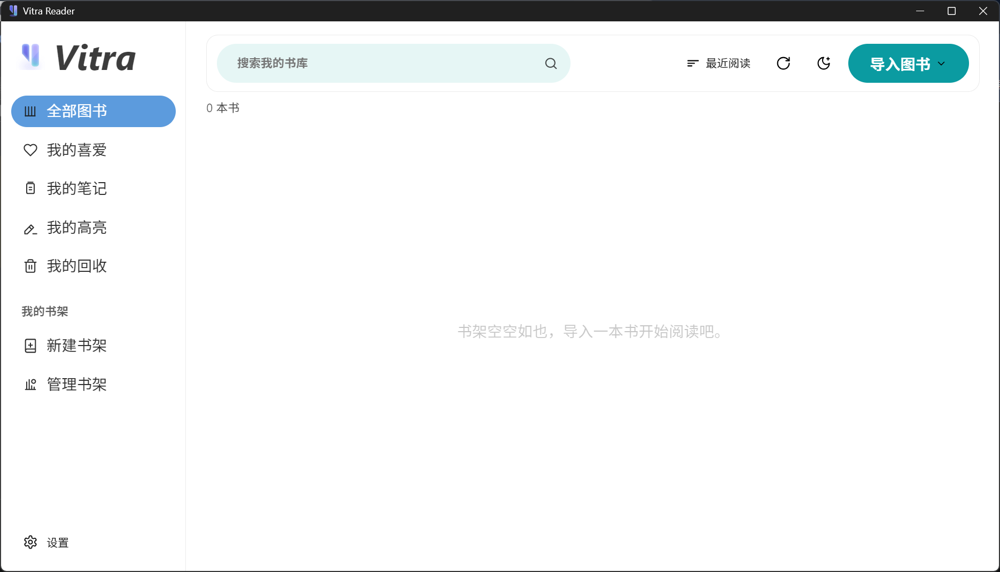

# Vitra Reader

[中文](./README.md) | [English](./README.en.md)

Vitra Reader is a desktop EPUB reader focused on **local-first data ownership, reading experience, and controllable sync**.  
Built with Electron + React + TypeScript, it aims to be a practical long-term reading app for daily use.

---

## Screenshot




---

## Why Vitra Reader

### Local-first, fully offline-capable
- EPUB files, progress, highlights/notes, and settings are stored locally.
- No account dependency for core reading workflows.

### Highly customizable reading experience
- Themes: Light / Dark / Sepia / Green + custom colors.
- Typography: font, size, line-height, letter-spacing, paragraph spacing, alignment.
- Reading modes: Paginated / Scrolled / Scrolled Continuous.

### Sync and backup under your control
- WebDAV support for private cloud / self-hosted servers.
- Backup modes: Full / Data-only / Files-only.
- Connection test, restore strategy, and automated sync pipeline.

### Practical library management
- Category views: All books, Favorites, Notes, Highlights, Trash.
- Shelf system: create, rename, dissolve, and move books between shelves.
- Grouped browsing in main content area via shelf cards.

---

## Core Features

### 1) Library & Import
- EPUB import with metadata parsing (title, author, cover)
- Search and sorting
- Reading progress visualization
- Context menu actions (favorite, add to shelf, trash, restore, permanent delete)

### 2) Reader
- EPUB rendering via epub.js
- TOC navigation
- Full-text search and result jump
- Keyboard navigation (Arrow keys / PageUp / PageDown)
- Text selection menu (copy, highlight, note, search, web search, read-aloud entry)

### 3) Reading Styles
- System font selection
- Font size / line-height / letter-spacing / paragraph spacing / page width / brightness
- Text alignment (left / justify / center)
- Custom foreground/background colors

### 4) Sync & Restore
- WebDAV connection testing
- Upload sync and download restore
- Sync modes (full/data/files)
- Restore modes (auto/full/data/files)
- Auto sync flow (startup pull + interval sync + pre-exit sync)

---

## Quick Start

### Requirements
- Node.js 18+
- npm 9+
- Windows 10/11 (current primary development platform)

### Install dependencies

```bash
npm install
```

### Run in development

```bash
npm run dev
```

### Build

```bash
npm run build
```

---

## Project Structure

```text
.
├─ electron/                  # Main process and preload
├─ src/
│  ├─ components/             # UI components (Library / Reader / Settings)
│  ├─ stores/                 # Zustand state stores
│  ├─ services/               # Storage, sync, and EPUB services
│  ├─ assets/                 # Icons and static resources
│  └─ styles/                 # Theme variables and global styles
├─ dist/                      # Frontend build output
└─ dist-electron/             # Electron build output
```

---

## Tech Stack

- Electron
- React 18
- TypeScript
- Vite
- Zustand
- Dexie.js (IndexedDB)
- epub.js
- Framer Motion

---

## Current Stage & Roadmap

Current stage: **Alpha (active iteration)**

Next:
- Translation services (DeepL / OpenAI / Custom API)
- TTS read-aloud (voice/rate configurable)
- Dictionary support (offline or online)
- Performance optimization for large EPUBs (Worker-based)
- Automated testing for critical paths (parsing, sync, reading state)

---

## Contributing & Feedback

Issues and PRs are welcome.  
Suggestions on reading stability, sync compatibility, and UI interaction are especially appreciated.
