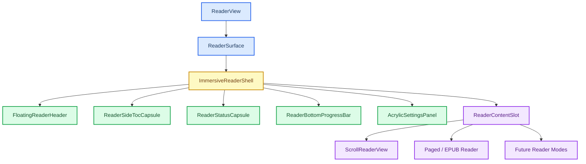

# Immersive Reader Shell Plan

本文记录将阅读器 UI 统一迁移到沉浸式毛玻璃阅读壳的设计方案。参考方向来自项目内 `bug/上下.html` 与 `bug/左右.html` 的视觉原型，但正文主题、字体、字号、行高、颜色仍保留当前 Vitra Reader 自己的设置系统。

## 🎯 目标

- **统一阅读外壳**：滚动阅读、分页阅读以及后续阅读模式共享同一套沉浸式 UI。
- **保留正文系统**：正文排版继续使用现有 reader settings，不直接套用原型 HTML 的主题或字体。
- **降低迁移风险**：先在全屏阅读中启用新壳，稳定后再迁移普通阅读模式。
- **避免双轨维护**：最终减少 `ReaderToolbar`、`ReaderFooter`、侧栏面板与全屏样式之间的重复逻辑。

## 🧭 原型特征

| 来源 | 主要方向 | 可复用特征 | 不直接复用内容 |
| --- | --- | --- | --- |
| `bug/上下.html` | 纵向沉浸阅读 | 顶部悬浮胶囊、左右触发区、右侧状态胶囊、底部细进度条、亚克力设置面板 | 原型正文颜色、字体、字号 |
| `bug/左右.html` | 横向分页阅读 | 横向分页氛围、左右点击区域、浮动状态、目录胶囊 | 直接使用 CSS columns 重写现有分页引擎 |

## 🧱 建议架构



## 🧩 组件边界

### `ImmersiveReaderShell`

负责统一阅读器外壳，不负责正文渲染。

建议职责：

- 管理沉浸式 UI 的显示与隐藏。
- 组织顶部胶囊、左侧目录、右侧状态、底部进度条、设置浮窗。
- 接收当前主题变量并应用到外层容器。
- 为不同 reader mode 提供统一 `content` 插槽。

建议 props：

```ts
interface ImmersiveReaderShellProps {
    bookTitleText: string;
    chapterLabel: string;
    clockText: string;
    content: React.ReactNode;
    isFullscreen: boolean;
    progressLabel: string;
    readerColors: ReaderColors;
    resolvedReaderFontFamily: string;
    settings: ReaderSurfaceSettings;
    settingsPanel: React.ReactNode;
    tocPanel: React.ReactNode;
    onBack: () => void;
    onToggleFullscreen: () => void;
    onToggleSettingsPanel: () => void;
}
```

### `ReaderContentSlot`

负责包裹不同阅读模式输出。

约束：

- 不修改正文 DOM 的阅读逻辑。
- 不改变 `ScrollReaderView` 的虚拟滚动、加载、选区、高亮行为。
- 只提供布局边界，例如全屏尺寸、阅读安全边距和 overflow 规则。

## 🪟 UI 行为设计

| 区域 | 默认状态 | 触发方式 | 说明 |
| --- | --- | --- | --- |
| 顶部胶囊 | 全屏时默认隐藏或弱显 | 顶部 hover、点击正文中部、键盘快捷键 | 包含返回、书名、目录、设置、全屏按钮 |
| 左侧目录胶囊 | 大屏隐藏，小屏不显示 | 左侧 hover 或点击目录按钮 | 后续替代当前普通侧栏目录入口 |
| 右侧状态胶囊 | 大屏隐藏，小屏不显示 | 右侧 hover 或 UI 唤醒 | 显示进度、章节、时间等状态 |
| 底部进度条 | 常驻 | 读书进度变化 | 细线样式，不占用正文高度 |
| 设置浮窗 | 隐藏 | 设置按钮 | 使用 acrylic 背景，不改变设置项逻辑 |

## 🧪 分阶段迁移

### Phase 1：全屏专用新壳

- 新增 `ImmersiveReaderShell` 与 CSS module。
- 保留现有普通阅读 UI。
- 只在 `isFullscreen === true` 时使用新壳。
- 目标是快速验证视觉与交互方向。

### Phase 2：接入目录与状态胶囊

- 将 TOC 数据或现有 `ReaderLeftPanel` 能力迁入左侧胶囊。
- 右侧胶囊接入 `progressLabel`、`chapterLabel`、`clockText`。
- 设置浮窗使用 acrylic 样式，但设置逻辑仍复用 `ReaderSettingsPanel`。

### Phase 3：普通阅读模式也统一新壳

- 非全屏也使用 `ImmersiveReaderShell`。
- 全屏与非全屏只通过 layout variant 区分。
- 逐步退役旧的 `ReaderToolbar` / `ReaderFooter` 外观职责。

### Phase 4：横向分页沉浸交互

- 参考 `bug/左右.html` 的左右点击区域与横向状态表达。
- 不直接用 CSS columns 替换现有分页引擎。
- 在分页 reader 内部适配统一 shell 的事件接口。

## ⚠️ 风险与注意事项

- **虚拟滚动同步**：全屏和容器尺寸变化必须触发虚拟段重算。
- **滚动穿透**：设置浮窗、目录胶囊内部滚动不能影响正文滚动。
- **移动端布局**：小屏优先隐藏左右胶囊，保留顶部胶囊和底部进度条。
- **主题变量**：UI acrylic 色彩可以派生自当前主题，但正文颜色和字体不能被原型样式覆盖。
- **渐进迁移**：不要一次性删除旧 UI，先并行验证新 shell。

## ✅ 建议下一步

1. 新建 `ImmersiveReaderShell.tsx` 与 `ImmersiveReaderShell.module.css`。
2. 将当前全屏逻辑从 `ReaderSurface` 迁入新 shell。
3. 全屏时渲染沉浸式 header、底部进度条与设置浮窗入口。
4. 跑 `npx tsc -b --pretty false`。
5. 通过后单独提交第一阶段改动。
