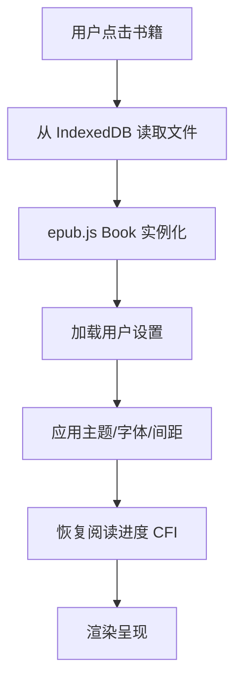

# EPUB 阅读器 — 开发文档

> **项目定位**：一款以**离线优先**为核心理念的跨平台 EPUB 阅读器，提供高度自定义的阅读体验（背景色、字体、行间距、翻页方式），并预留 WebDAV 同步与 API 翻译扩展能力。


---

## 1. 技术栈与平台适配

| 层级 | 选型 | 理由 |
|---|---|---|
| **目标平台** | **Windows (优先)** | 针对 Win10/11 进行优化，支持 Fluent Design / Mica 效果 |
| **桌面框架** | **Electron** | 深度集成 Windows API，支持托盘、快捷方式、原生对话框 |
| **前端框架** | **React 18 + TypeScript** | 强类型保障配置逻辑准确性 |
| **构建工具** | **Vite** | 极速 HMR |
| **EPUB 渲染** | **epub.js** | 核心渲染引擎 |
| **本地存储** | **Dexie.js** (IndexedDB) | 离线书库与配置持久化 |
| **UI 组件库** | **Radix UI + Lucid Icons** | 保证高自定义程度与无障碍支持 |

**Windows 特色适配建议**：
- **标题栏定制**：使用 `titleBarStyle: 'hiddenInset'` 或自定义标题栏，实现类似 Windows 11 的沉浸式界面。
- **性能优化**：针对离线大文件读取，使用 Electron 主进程的 `fs` 预取数据。
- **系统集成**：支持通过右键菜单直接“使用该阅读器打开 .epub”。

---

## 2. 项目结构

```
epub-reader/
├── electron/                    # Electron 主进程
│   ├── main.ts                  # 主进程入口
│   ├── preload.ts               # 预加载脚本 (安全桥接)
│   └── ipc/                     # IPC 通信处理
│       ├── fileHandler.ts       # 文件导入/导出
│       └── webdavHandler.ts     # WebDAV 操作 (TODO)
├── src/                         # 渲染进程 (React)
│   ├── main.tsx                 # React 入口
│   ├── App.tsx                  # 根组件 & 路由
│   ├── components/
│   │   ├── Library/             # 书库视图
│   │   │   ├── BookCard.tsx     # 书籍卡片
│   │   │   ├── BookGrid.tsx     # 网格布局
│   │   │   └── ImportButton.tsx # 导入按钮
│   │   ├── Reader/              # 阅读器核心
│   │   │   ├── ReaderView.tsx   # 阅读主视图 (epub.js 容器)
│   │   │   ├── Toolbar.tsx      # 顶部工具栏
│   │   │   ├── TOCPanel.tsx     # 目录面板
│   │   │   └── ProgressBar.tsx  # 进度条
│   │   └── Settings/            # 设置面板
│   │       ├── ThemeSettings.tsx       # 背景/主题设置
│   │       ├── FontSettings.tsx        # 字体设置
│   │       ├── SpacingSettings.tsx     # 行间距/段间距设置
│   │       ├── PageTurnSettings.tsx    # 翻页方式设置
│   │       └── WebDavSettings.tsx      # WebDAV 配置 (TODO)
│   ├── stores/
│   │   ├── useReaderStore.ts    # 阅读器状态
│   │   ├── useSettingsStore.ts  # 用户设置状态
│   │   └── useLibraryStore.ts   # 书库状态
│   ├── services/
│   │   ├── epubService.ts       # EPUB 解析/渲染封装
│   │   ├── storageService.ts    # IndexedDB 操作
│   │   ├── themeService.ts      # 主题/CSS Variables 管理
│   │   ├── webdavService.ts     # WebDAV 同步 (TODO)
│   │   └── translateService.ts  # 翻译服务 (TODO)
│   ├── styles/
│   │   ├── variables.css        # CSS Variables 定义 (主题根)
│   │   ├── global.css           # 全局基础样式
│   │   └── themes/              # 预设主题
│   │       ├── light.css
│   │       ├── dark.css
│   │       └── sepia.css
│   ├── types/
│   │   └── index.ts             # TypeScript 类型定义
│   └── utils/
│       ├── colorUtils.ts        # 颜色工具函数
│       └── fontLoader.ts        # 字体加载器
├── public/
│   └── fonts/                   # 内置字体文件
├── package.json
├── vite.config.ts
├── electron-builder.json        # 打包配置
└── tsconfig.json
```

---

## 3. 核心功能模块

### 3.1 主题与颜色控制

**参考 UI 设计**：
- **颜色选择器**：包含预设色块 + “清除/恢复默认”按钮 (垃圾桶图标) + “更多自定义”按钮 (三点图标)。
- **实时同步**：背景色 (Background) 与 文字颜色 (Foreground) 独立设置，互不干扰且实时生效。

```typescript
// 推荐的颜色预设 (基于截图)
const BG_PRESETS = [
  '#FFFFFF', '#1E1E1E', '#EAD8B1', '#C7E9C0', 
  '#2C5364', '#7FD8BE', '#9B7246', '#87CEEB'
];

const TEXT_PRESETS = [
  '#000000', '#FFFFFF', '#5D4037', '#2D4A3E',
  '#003366', '#E0F7FA', '#8D6E63', '#40E0D0'
];
```

---

### 3.2 深度自定义设置 (Slider + Input)

针对 Windows 习惯，提供 **Slider + 数字输入框** 双向绑定联动。

| 设置项 | 范围 | 默认值 | 截图参考说明 |
|---|---|---|---|
| **字体大小** | 13 – 40 | 22 | 支持滑块拖拽或输入精确数值 |
| **页边距** | -40 – 80 | 0 | 调整阅读区域与边缘的间距 |
| **字间距** | 0 – 20 | 3 | 控制字符间的宽松感 |
| **段落间距** | 0 – 100 | 23 | 段落之间的垂直距离 |

```typescript
// fontLoader.ts
interface FontConfig {
  family: string;       // 字体族名称
  displayName: string;  // 显示名称
  source: 'builtin' | 'system' | 'custom';
  url?: string;         // 自定义字体文件路径
}

// 内置字体列表
const BUILTIN_FONTS: FontConfig[] = [
  { family: 'Noto Serif SC', displayName: '思源宋体', source: 'builtin' },
  { family: 'Noto Sans SC', displayName: '思源黑体', source: 'builtin' },
  { family: 'LXGW WenKai', displayName: '霞鹜文楷', source: 'builtin' },
  { family: 'serif', displayName: '系统衬线', source: 'system' },
  { family: 'sans-serif', displayName: '系统无衬线', source: 'system' },
];

// 加载自定义字体 (用户上传 .ttf/.otf/.woff2)
async function loadCustomFont(file: File): Promise<FontConfig> {
  const fontFace = new FontFace(file.name, await file.arrayBuffer());
  await fontFace.load();
  document.fonts.add(fontFace);
  return { family: file.name, displayName: file.name, source: 'custom' };
}

// 应用字体到 epub.js
function applyFont(rendition: Rendition, fontFamily: string, fontSize: number): void {
  rendition.themes.font(fontFamily);
  rendition.themes.fontSize(`${fontSize}px`);
}
```

---

### 3.3 视图模式 (Pagination Modes)

提供三种核心布局，对应截图中的顶部图标：

1.  **单页模式 (Single Column)**：
    - `flow: "paginated"`, `spread: "none"`
    - 屏幕中央单块文本，适合小窗或窄屏。
2.  **双页模式 (Double Column)**：
    - `flow: "paginated"`, `spread: "always"`
    - 模拟纸质书籍展开效果，自动利用宽屏空间。
3.  **连续滚动 (Continuous Scroll)**：
    - `flow: "scrolled"`, `manager: "default"`
    - 网页般的纵向阅读体验。

```typescript
type PageTurnMode = 'paginated' | 'scrolled' | 'scrolled-continuous';

function initRendition(book: Book, mode: PageTurnMode, container: HTMLElement): Rendition {
  const flowConfig: Record<PageTurnMode, object> = {
    'paginated': {
      flow: 'paginated',        // 左右翻页
      spread: 'auto',           // 自动双页
      width: '100%',
      height: '100%',
    },
    'scrolled': {
      flow: 'scrolled-doc',     // 单章滚动
      width: '100%',
    },
    'scrolled-continuous': {
      flow: 'scrolled',         // 全书连续滚动
      width: '100%',
    },
  };

  return book.renderTo(container, {
    ...flowConfig[mode],
    allowScriptedContent: false,  // 安全：禁止脚本
  });
}
```

**翻页交互支持**：

| 操作方式 | 分页模式 | 滚动模式 |
|---|---|---|
| 点击屏幕左/右区域 | ✅ 上/下页 | — |
| 左右滑动 (触屏) | ✅ 上/下页 | — |
| 键盘 ← → / PgUp PgDn | ✅ 上/下页 | ✅ 滚动 |
| 鼠标滚轮 | ✅ 上/下页 | ✅ 自然滚动 |
| 翻页动画 | 滑动 / 渐变 | — |

```typescript
// 翻页手势 & 键盘绑定
function bindPageTurnEvents(rendition: Rendition): void {
  // 键盘
  document.addEventListener('keydown', (e) => {
    if (e.key === 'ArrowRight' || e.key === 'PageDown') rendition.next();
    if (e.key === 'ArrowLeft' || e.key === 'PageUp') rendition.prev();
  });

  // 点击左右区域
  rendition.on('click', (e: MouseEvent) => {
    const width = window.innerWidth;
    if (e.clientX < width * 0.3) rendition.prev();
    else if (e.clientX > width * 0.7) rendition.next();
  });
}
```

---

## 4. 数据模型

```typescript
// types/index.ts

/** 书籍元数据 */
interface BookMeta {
  id: string;                // UUID
  title: string;
  author: string;
  cover?: string;            // Base64 封面图
  publisher?: string;
  language?: string;
  fileSize: number;          // 文件大小 (bytes)
  addedAt: number;           // 导入时间戳
  lastReadAt?: number;       // 最后阅读时间
}

/** 阅读进度 */
interface ReadingProgress {
  bookId: string;
  location: string;          // epub.js CFI 定位字符串
  percentage: number;        // 0-100
  currentChapter: string;
  updatedAt: number;
}

/** 用户设置 (全局 + 单书覆盖) */
interface ReaderSettings {
  // 主题
  themeId: string;
  customBgColor?: string;
  customTextColor?: string;
  // 字体
  fontFamily: string;
  fontSize: number;
  fontWeight: 'normal' | 'bold';
  // 间距
  lineHeight: number;
  paragraphSpacing: number;
  letterSpacing: number;
  pagePadding: number;
  // 翻页
  pageTurnMode: PageTurnMode;
  pageTurnAnimation: 'slide' | 'fade' | 'none';
  
  // 界面外观 (新增)
  uiMaterial: 'default' | 'mica' | 'acrylic';
  uiBlurStrength: number;     // 0-40 px
  uiOpacity: number;          // 0.5-1.0
  uiRoundness: number;        // 圆角半径
  uiAnimation: boolean;
}

/** 书签 */
interface Bookmark {
  id: string;
  bookId: string;
  location: string;          // CFI
  title: string;             // 用户自定义标题 或 自动截取
  createdAt: number;
}
```

---

## 5. IndexedDB 存储方案

使用 **Dexie.js** 封装 IndexedDB：

```typescript
// storageService.ts
import Dexie, { Table } from 'dexie';

class ReaderDatabase extends Dexie {
  books!: Table<BookMeta>;
  bookFiles!: Table<{ id: string; data: ArrayBuffer }>;  // 书籍文件本体
  progress!: Table<ReadingProgress>;
  bookmarks!: Table<Bookmark>;
  settings!: Table<{ key: string; value: ReaderSettings }>;

  constructor() {
    super('EPubReaderDB');
    this.version(1).stores({
      books: 'id, title, author, addedAt, lastReadAt',
      bookFiles: 'id',
      progress: 'bookId',
      bookmarks: 'id, bookId, createdAt',
      settings: 'key',
    });
  }
}

export const db = new ReaderDatabase();
```

---

## 6. 核心流程

### 6.1 书籍导入流程


### 6.2 阅读器启动流程



### 6.3 设置变更流程


---

## 7. TODO 功能规划

### 7.1 WebDAV 备份与恢复

**目标**：将阅读进度、书签、设置同步到用户自建的 WebDAV 服务器（如坚果云、NextCloud）。

```typescript
// webdavService.ts (规划)
interface WebDavConfig {
  serverUrl: string;       // e.g. https://dav.jianguoyun.com/dav/
  username: string;
  password: string;        // 应用专用密码
  remotePath: string;      // 远程目录 e.g. /epub-reader/
}

interface SyncData {
  version: number;
  exportedAt: number;
  settings: ReaderSettings;
  progress: ReadingProgress[];
  bookmarks: Bookmark[];
  bookMeta: BookMeta[];     // 仅元数据，不含文件本体
}

class WebDavService {
  async testConnection(config: WebDavConfig): Promise<boolean>;
  async backup(data: SyncData): Promise<void>;       // 上传 JSON
  async restore(): Promise<SyncData>;                 // 下载 JSON
  async syncMerge(local: SyncData, remote: SyncData): Promise<SyncData>;  // 冲突合并
}
```

**同步策略**：
- 导出为 JSON 文件上传到 WebDAV（轻量，仅同步元数据和进度，不同步书籍文件）
- 支持手动备份/恢复 + 可选自动同步（启动时 & 退出时）
- 冲突合并：以 `updatedAt` 时间戳为准，取最新记录

---

### 7.2 API 翻译

**目标**：用户自行配置翻译 API，选中文本后即时翻译。

```typescript
// translateService.ts (规划)
interface TranslateConfig {
  provider: 'deepl' | 'openai' | 'custom';
  apiKey: string;
  endpoint?: string;       // 自定义 API 端点
  targetLang: string;      // 目标语言
  model?: string;          // OpenAI 模型选择
}

class TranslateService {
  async translate(text: string, config: TranslateConfig): Promise<string> {
    switch (config.provider) {
      case 'deepl':
        return this.callDeepL(text, config);
      case 'openai':
        return this.callOpenAI(text, config);
      case 'custom':
        return this.callCustom(text, config);
    }
  }
}
```

**交互方式**：
- 选中文本 → 弹出气泡菜单 → 点击「翻译」
- 翻译结果以 Popover 形式展示在选中文本下方
- 支持段落翻译（整段对照模式）

---

## 8. UI 设计与美化 (Visual Polish)

**核心理念：高度可配置 (Configurable Aesthetics)**

不仅仅是提供一种好看的界面，而是将“美化权”交给用户。所有特效均可开启/关闭或调节强度。

### 8.1 外观自定义选项 (Appearance Settings)

- **窗口材质 (Window Material)**：
    - [x] **启用云母效果 (Mica/Acrylic)**：让窗口背景透出桌面壁纸颜色。
    - **不透明度 (Opacity)**：`0.5` — `1.0` 滑块调节。

- **面板特效 (Panel Effects)**：
    - [x] **启用毛玻璃 (Blur)**：侧边栏与浮窗背景模糊 (`backdrop-filter`)。
    - **模糊强度**：`0px` — `40px` 滑块调节。
    - **圆角大小**：`0px` (直角) — `20px` (大圆角)。
    - **界面密度**：`紧凑` / `舒适` / `宽松`。

- **微交互动画**：
    - [x] **启用界面动画**：面板滑出的回弹效果、按钮缩放等。
    - **动画速度**：`慢` / `正常` / `快`。

### 8.2 整体布局

```
┌──────────────────────────────────────────────┐
│  ← 返回    书名            ≡ 目录   ⚙ 设置  │  ← Toolbar (自动隐藏)
├───────┬──────────────────────────────┬───────┤
│       │                              │       │
│       │                              │       │
│ 目 录 │        阅 读 内 容 区         │ 设 置 │
│       │                              │       │
│ 面 板 │      (epub.js 渲染区域)       │ 面 板 │
│       │                              │       │
│ (左)  │                              │ (右)  │
├───────┴──────────────────────────────┴───────┤
│  第 5 章        ████████░░░░  45%            │  ← 底部进度条
└──────────────────────────────────────────────┘
```

### 8.2 设置面板（侧栏抽屉）

```
┌─ 阅读设置 ──────────────────┐
│                              │
│  🎨 主题                     │
│  ○ 浅色 ○ 深色 ○ 羊皮纸 ○ 护眼│
│  自定义: [■ bg] [■ text]     │
│                              │
│  🔤 字体                     │
│  字体: [思源宋体      ▾]     │
│  字号: ◄──●──────────► 18px  │
│                              │
│  📏 间距                     │
│  行间距: ◄────●──────► 1.6   │
│  段间距: ◄──●────────► 8px   │
│  页边距: ◄─────●─────► 40px  │
│                              │
│  📖 翻页                     │
│  ○ 左右翻页  ○ 上下滚动      │
│  ○ 连续滚动                  │
│  动画: [滑动 ▾]              │
│                              │
└──────────────────────────────┘
```

---

## 9. 性能与预加载策略 (Preloading Everywhere)

为确保“丝滑”体验，在以下环节引入预加载逻辑：

### 9.1 书库层：交互感知预加载
- **封面预取**：使用极轻量的 `Intersection Observer` 结合浏览器缓存。
- **悬停解析**：当鼠标悬停 (Hover) 在书籍卡片超过 300ms 时，静默开启 `epub.js` 的后端解析，提取 TOC 和上次阅读进度。

### 9.2 阅读层：内容预加载
- **邻近章节预加载**：
    - **分页模式**：在当前页还有 2 页到末尾时，静默渲染下一章节到隐藏的容器中。
    - **滚动模式**：已在进阶方案中细化（前置 20% 渲染）。
- **资源预拉取**：优先加载书中的本地图片/字体资源。

### 9.3 扩展层：异步预处理
- **翻译预处理**：开启自动翻译模式时，预先发送当前视野下方的一段文本至缓存。
- **TTS 预转录**：TTS 队列始终维持 3-5 句的预合成音频，防止网络延迟导致声音断续。

---

## 10. 开发阶段规划
- [ ] 项目初始化 (Electron + Vite + React + TypeScript)
- [ ] EPUB 文件导入与解析 (epub.js)
- [ ] 基础阅读视图渲染
- [ ] 左右翻页 + 滚动模式
- [ ] 目录 (TOC) 导航
- [ ] 阅读进度保存/恢复

### Phase 2 — 自定义阅读体验
- [ ] 主题系统 (预设 + 自定义颜色)
- [ ] 字体切换 (内置 + 自定义上传)
- [ ] 行间距 / 段间距 / 字间距 / 页边距
- [ ] 翻页模式切换 & 翻页动画
- [ ] 全局设置 + 单书设置覆盖

### Phase 3 — 书库管理
- [ ] 书库网格/列表视图
- [ ] 书籍搜索与排序
- [ ] 书架分类
- [ ] 书签系统

### Phase 4 — 同步与扩展 (TODO)
- [ ] WebDAV 三种模式备份 (完全/数据/文件)
- [ ] 极致连续滚动优化 (无缝、无缝隙连接)
- [ ] TTS 语音听书 (Edge TTS 集成)
- [ ] API 翻译扩展 (DeepLX / OpenAI / DeepL)
- [ ] 选中文本翻译 UI 与 缓存系统

---

## 10. 构建与打包

```bash
# 开发模式
npm run dev          # Vite dev server + Electron

# 构建
npm run build        # TypeScript 编译 + Vite 构建
npm run package      # electron-builder 打包

# 目标平台
# Windows: .exe (NSIS installer) / .msi
# macOS:   .dmg
# Linux:   .AppImage / .deb
```

**electron-builder 配置要点**：

```json
{
  "appId": "com.epubreader.app",
  "productName": "EPUB Reader",
  "files": ["dist/**/*", "electron/**/*"],
  "win": { "target": ["nsis"] },
  "mac": { "target": ["dmg"] },
  "linux": { "target": ["AppImage", "deb"] },
  "extraResources": ["public/fonts/**"]
}
```

---

## 11. 关键依赖清单

| 包名 | 版本 | 用途 |
|---|---|---|
| `electron` | ^29.x | 桌面框架 |
| `react` / `react-dom` | ^18.x | UI 框架 |
| `epubjs` | ^0.3.x | EPUB 解析与渲染 |
| `dexie` | ^4.x | IndexedDB 封装 |
| `zustand` | ^5.x | 状态管理 |
| `vite` | ^6.x | 构建工具 |
| `vite-plugin-electron` | latest | Electron + Vite 集成 |
| `electron-builder` | latest | 打包工具 |
| `webdav` | ^5.x | WebDAV 客户端 (TODO) |
